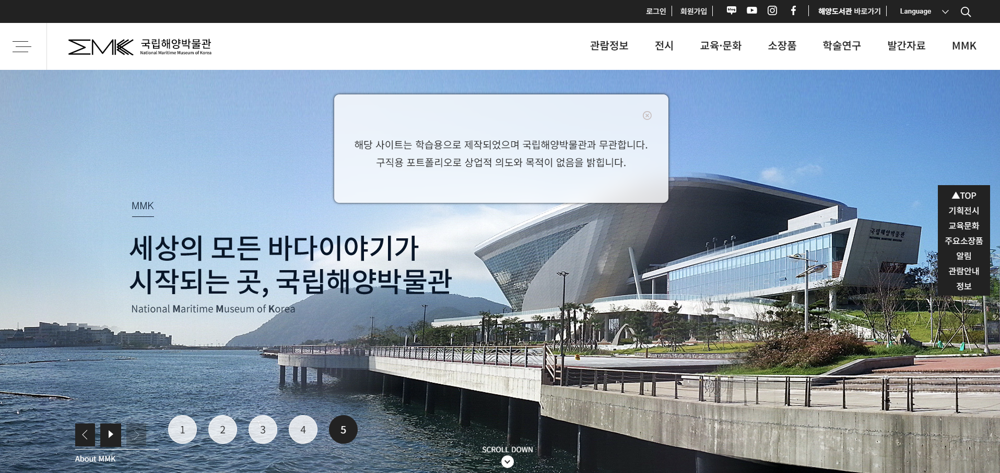
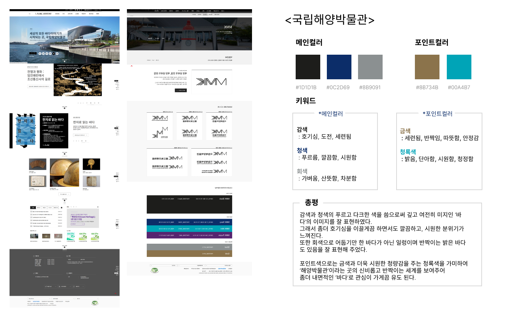
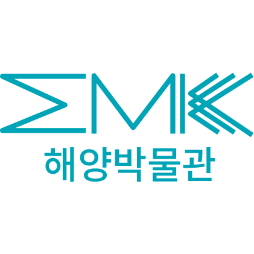
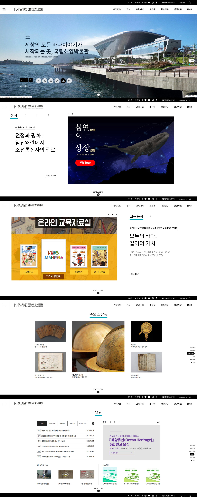

# 프로젝트1 '국립해양박물관'

▶ 메인 스크린샷

> 기획서 보기

https://drive.google.com/file/d/141mT4Bx7_LU9bBWjZ8YKTofaIxxSDdyg/view?usp=drive_link

## 목차

- 기획서 보기
- 콘셉트 도출
- 로고 리디자인
- 리디자인 프로토타입
-  특징
- 브라우저 호환성
- 기술사양
- 연락처

## 콘셉트 도출

▶ 사이트를 분석해 나온 대표 컬러와 키워드

## 로고 리디자인

▶ 국립해양박물관답게 물고기 컨셉으로 리디자인한 로고

## 프로토타입

▶ 리디자인한 프로토타입

## 특징
- scroll snap
- fullpage

## 브라우저 호환성
- Chrome
- Mozilla
- Opera
- Edge
- Safari

## 기술사양
- HTML5
- CSS3
- jquery-2.2.4.js
- jquery.fullPage.js
- swiper-bundle.min.js

## 연락처

Created By 1618wlsdk@gmail.com